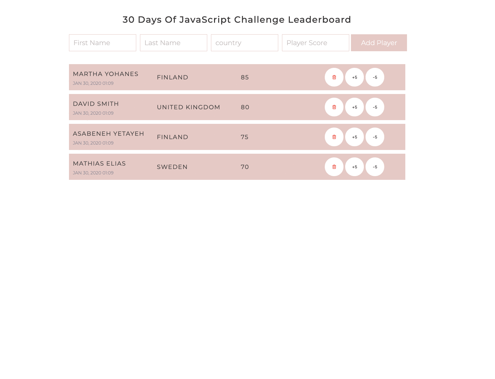

[<< Day 27](../27_Day_Mini_project_portfolio/27_day_mini_project_portfolio.md) | [Day 29>>](../29_Day_Mini_project_animating_characters/29_day_mini_project_animating_characters.md)

- [Day 28](#day-28)
  - [Exercises](#exercises)
    - [Exercise: Level 1](#exercise-level-1)

# Day 28

## Exercises

### Exercise: Level 1

1. Create the following using HTML, CSS, and JavaScript

🎉 CONGRATULATIONS ! 🎉

[<< Day 27](../27_Day_Mini_project_portfolio/27_day_mini_project_portfolio.md) | [Day 29>>](../29_Day_Mini_project_animating_characters/29_day_mini_project_animating_characters.md)